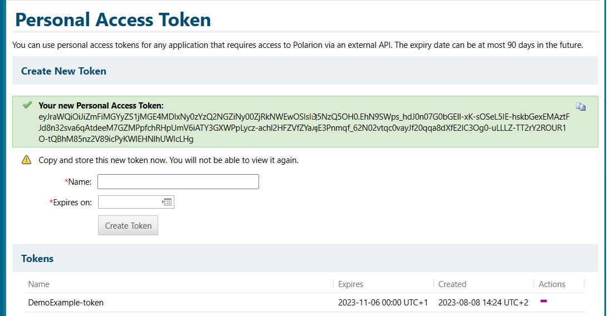

# Quick Demo with Polarion setup

## Installation (Windows)

Polarion requires license with free trial use without external requests,
only local ones.

After run the installation the server is automatically placed on
https://localhost:80. The user can search for Polarion on the initial menu and 
start the menu, open the main page, and other server related activities.

In the main screen the first login is user: ``admin`` and password: ``admin``. 
Tokens and other user can be created on the software as well teams and holes.

## Quick-Start

This quick-start will guide regarding how to create a project, Test Cases, and
Test Runs to be used byt the plugin.
The image show the main page of polarion:


*Step 1/12*: In the upper bar you can create a new project clicking on ``Default Repository``, 
the one that will be used for this demo:


*Step 2/12*: Select the project name (will be used as ID for ``pytest-typhoon-polarion`` 
plugin later by the option ```) and go **Next**:


*Step 3/12*: For the Template select ``Agile Software Project (Product and Release Backlogs, 
Sprint Management, Quality Assurance, Builds)``. This project has configured the
issues as **Test Cases** and later can be used on the **Test Runs**:


*Step 4/12*: Confirm with **Next**, and continue until the **Creation** stage and 
wait a few seconds. The project is created successfully. Now, navigate on the 
lateral tab on (1) **Work Items** then select the (2) "+" button, and (3) 
**Test Case**.


*Step 5/12*: Fill the test specification **Title**, Test Type as Automated Test and click on 
the **Save** button, automatically Polarion will create an ID for the test case,
that will be used to mark the test later on pytest:


*Step 6/12*: After that change the Status to ``Perform action Activate`` and **Save** once
again:


*Step 7/12*: With the test or tests cases created select on the lateral menu **Expand** and 
then **Test Runs**:


On Test Runs you can **Manage Templates** in the upper right corner. 
You can create a new Template or change the existent one in the list.
In order to work with pytest the template needs to be Type ``Automated``. 
In this example we replace the ``manual`` type to ``Automated`` in the Release
Test templates. When marked as automated the test ca still be run as manual.


*Step 8/12*: Click in **New** and select a Template type and a Test Run ID, 
which will be also configured by the plugin, using the option 
``--polarion-test-run``.


*Step 9/12*: After created configure the **Query** of the test run to collect
the test based on filter. In this example the filter selected is 
``type:testcase AND status:active``.


*Step 10/12*: Automatically the Test Case created will be linked with the Test 
Run. Now, so the plugin can change the Test Results one manual execution needs 
to happen through Polarion. Click in **Execute Tests**.


*Step 11/12*: Click to **Start** the test and give any **Veredict** 
(E.g.: Blocked). And save the Veredict.


The test case will shown as executed instead of waiting.


*Step 12/12*: Now with the Test Run populated we can start to write our test 
using pytest. Create a file called ``test_demo_example.py`` and write the 
follow simple test.

```python
import pytest
from typhoon.test.signals import pandas_sine
import typhoon.test.harmonic as harmonic
    
@pytest.mark.polarion(test_id="DE-391")  # ID from the Polarion Test Case
def test_check_vab_freq():
    amp = 1
    freq = 60
    
    # Signal is an API generated signal, can also be capture from HIL Simulation
    signal = pandas_sine(amplitude=amp, frequency=freq, Ts=1e-3)

    # Frequency Analysis
    content = harmonic.frequency_content(signal, 240)

    assert abs(content(60)) == amp, "60 Hz amplitude not correct"
```

And add the secrets file in the same folder with your user information:
```plain text
POLARION_HOST=http://localhost:80/polarion
POLARION_USER=admin
POLARION_PASSWORD=admin
```

And execute using the following command (Typhoon-HIL Control Center needs to be 
installed):

```commandline
pytest .\test_demo_example.py --polarion-project-id=DemoExample --polarion-test-run=REL --secrets=secrets 
```

This test is a pass case and is possible to see on Polarion at the end of the
execution the test assertion changed. With this setup done is possible to write
more test cases in Polarion, implement using Typhoontest API and have all the
Test Results in Polarion page.


## More about authentication

By usage, is noticed that Polarion don`t allow password request after a token or
XML key is configured, after configuring any stronger authentication method the
password is deprecated, even if this one is expired or deleted. Only used to 
access Polarion by the browser.

### How to create a token (Valid for maximum 90 days):
Navigate on ``Show Settings``, the Engine below the Pn symbol in the left-up
corner, an the ``My Account``, and ``Personal Access Token`` on the upper-center,
below the page header.


Enter the name and the expiration date, at least for Trial versions the token
needs a expiration date equal or smaller then 90 days.


Then the token is shown only once, copy the content and paste in your secret 
file under the tag ``POLARION_TOKEN``. 



```plain text
POLARION_HOST=http://localhost:80/polarion
POLARION_USER=admin
POLARION_PASSWORD=admin
POLARION_TOKEN=eyJraWQiOiJiZmFiMGYyZS1jMGE4MD ...
```
